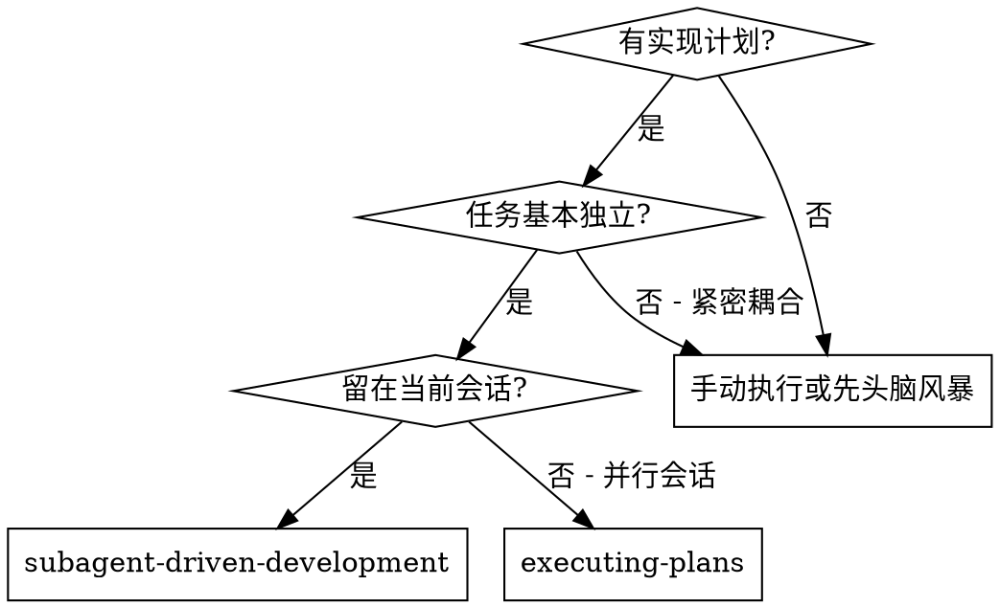
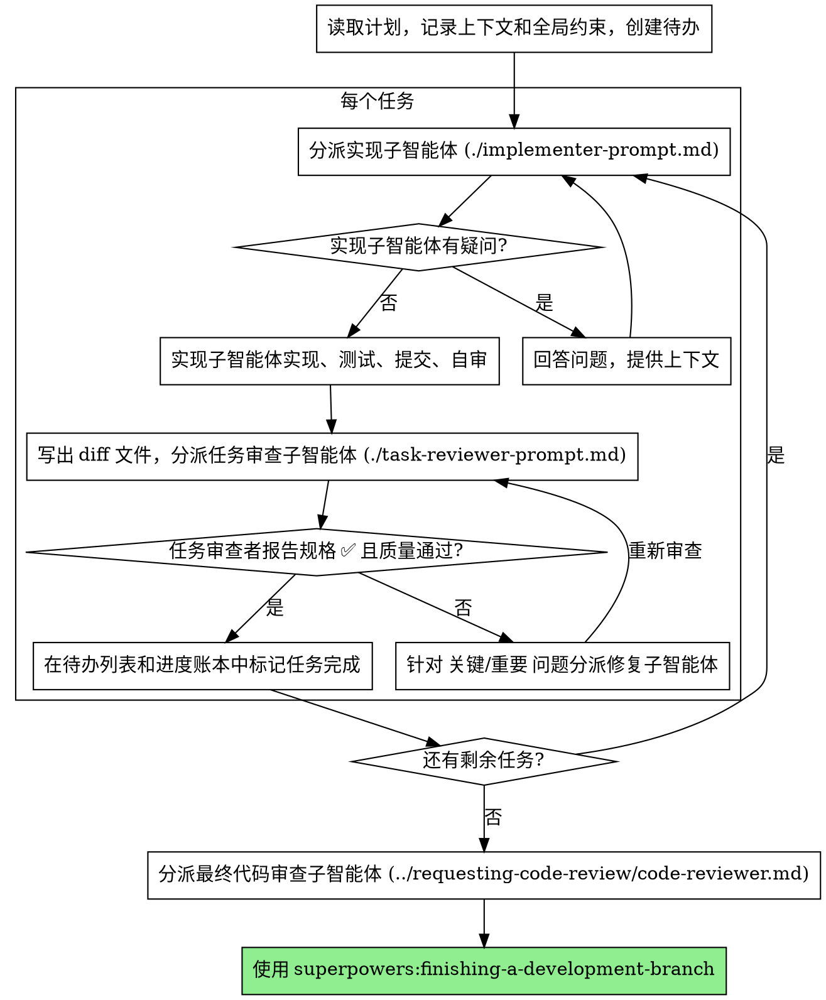

# 子智能体驱动开发

通过为每个任务分派一个全新的实现子智能体来执行计划：每个任务完成后做一次任务审查（规格合规性 + 代码质量），全部任务结束后再做一次覆盖整个分支的宽范围审查。

**为什么用子智能体：** 你把任务委派给具有隔离上下文的专用智能体。通过精心设计它们的指令和上下文，确保它们专注并成功完成任务。它们绝不应继承你会话的上下文或历史记录——你要精确构造它们所需的一切。这样也能为你自己保留用于协调工作的上下文。

**核心原则：** 每个任务一个全新子智能体 + 任务审查（规格 + 质量）+ 结尾宽范围审查 = 高质量、快速迭代

**旁白：** 工具调用之间最多说一句简短的旁白——进度账本和工具结果本身就是记录。

**持续执行：** 不要在任务之间停下来向你的人类伙伴确认。不间断地执行计划里的所有任务。唯一该停下的理由是：你无法解决的 BLOCKED 状态、确实妨碍推进的歧义，或所有任务已完成。"我该继续吗？"之类的询问和进度小结都在浪费他们的时间——他们让你执行计划，那就执行。

## 何时使用



**与 Executing Plans（并行会话）的对比：**
- 同一会话（无上下文切换）
- 每个任务全新子智能体（无上下文污染）
- 每个任务后做审查（规格合规性 + 代码质量），结尾做宽范围审查
- 更快的迭代（任务间无需人工介入）

## 流程



## 起飞前的计划审查

在分派任务 1 之前，先把计划整体扫一遍，找出冲突：

- 相互矛盾、或与计划"全局约束"矛盾的任务
- 计划明确要求、但审查评分标准会判定为缺陷的东西（一个什么都不断言的测试、逐字重复的逻辑块）

把你发现的所有问题**打包成一个问题**呈给你的人类伙伴——每一处发现都紧挨着强制它的计划原文，问哪一方说了算——在执行开始之前一次性问清，而不是在计划执行途中每发现一处就打断一次。如果扫描下来很干净，就不作声、直接开始。审查循环仍然是那些只有在实现时才暴露出来的冲突的兜底网。

## 模型选择

在能胜任每个角色的前提下，使用最弱的模型，以节省成本、提高速度。

**机械性实现任务**（隔离的函数、清晰的规格、1-2 个文件）：使用快速、便宜的模型。当计划编写得足够详细时，大多数实现任务都是机械性的。

**集成和判断类任务**（多文件协调、模式匹配、调试）：使用标准模型。

**架构和设计类任务**：使用最强的可用模型。最终的整分支审查就属于这一类——用最强的可用模型来分派它，而不是会话默认模型。

**审查类任务**：用同样的判断力去选模型，并按 diff 的规模、复杂度和风险来缩放。一个小的机械性 diff 不需要最强的模型；一处微妙的并发改动才需要。

**分派子智能体时永远显式指定模型。** 省略模型会默默继承你会话的模型——往往是最强也最贵的那个——从而悄悄让本节的努力落空。

**轮次数比 token 单价更重要。** 墙钟时间和上下文成本随子智能体所用的轮次数增长，而最便宜的模型在多步工作上常常要多花 2-3 倍的轮次——总成本反而更高。给审查者、以及从散文式描述开工的实现者，用中档模型作为下限。当任务的计划文本已经包含要写的完整代码时，实现就是誊写加测试：那种实现者用最便宜的档位。单文件的机械性修复也用最便宜的档位。

**任务复杂度信号（实现任务）：**
- 涉及 1-2 个文件且有完整规格 → 便宜模型
- 涉及多个文件且有集成考虑 → 标准模型
- 需要设计判断或广泛的代码库理解 → 最强模型

## 处理实现者状态

实现子智能体会报告四种状态之一。对每种状态做相应处理：

**DONE：** 生成审查包（在本技能目录下运行 `scripts/review-package BASE HEAD`——它会打印出自己写入的那个唯一文件路径；BASE 是你在分派实现者之前记录下来的那个提交——**绝不用** `HEAD~1`，那会悄悄丢掉多提交任务里除最后一个之外的所有提交），然后把打印出的路径交给任务审查者去分派。

**DONE_WITH_CONCERNS：** 实现者完成了工作但标记了疑虑。在继续之前先读这些疑虑。如果疑虑涉及正确性或范围，在审查前先解决。如果只是观察性说明（例如"这个文件越来越大了"），记录下来并继续进入审查。

**NEEDS_CONTEXT：** 实现者需要未提供的信息。补上缺失的上下文并重新分派。

**BLOCKED：** 实现者无法完成任务。评估阻塞原因：
1. 如果是上下文问题，提供更多上下文并用同一模型重新分派
2. 如果任务需要更强的推理能力，用更强的模型重新分派
3. 如果任务太大，拆分为更小的部分
4. 如果计划本身有问题，上报给人类

**绝不**忽略一次上报，也绝不在不做任何更改的情况下强迫同一模型重试。如果实现者说卡住了，那就说明有什么东西需要改变。

## 处理审查者的 ⚠️ 事项

任务审查者可能会报告"⚠️ 无法从 diff 中核实"的事项——那些藏在未改动代码里、或横跨多个任务的需求。这些事项不会阻塞审查的其余部分，但在标记任务完成之前你必须逐一亲自解决：你手里握着计划和跨任务上下文，而审查者没有。如果你确认某一项确实是真实的缺口，就把它当作一次未通过的规格审查处理——退回给实现者并重新审查。

## 构造审查者提示词

每个任务的审查都是任务范围内的关卡。宽范围审查只发生一次，在最终的整分支审查。当你填写审查者模板时：

- 不要在没有具体、任务专属理由的情况下，加入"检查所有用法"或"如果有用就跑竞态测试"这类开放式指令
- 不要让审查者去重跑实现者已经在同一份代码上跑过的测试——实现者的报告已经带着测试证据
- 不要替审查者预判发现——绝不指示审查者去忽略或不上报某个具体问题。如果你认为某个发现会是误报，那就让审查者提出来，在审查循环里裁定它。如果你正在写的提示词里出现了"不要标记""别把 X 当缺陷""顶多算 Minor""计划选择了"——停下：你在预判，通常是为了省掉一轮审查。
- 你交给审查者的全局约束块是它的注意力透镜。从计划的"全局约束"一节或规格里**逐字**抄下有约束力的需求：精确的取值、精确的格式、以及组件之间被明确规定的关系（"与 X 相同的布局""匹配 Y"）。审查者的模板里已经带着流程规则（YAGNI、测试卫生、审查方法）——约束块是留给**本项目**规格所要求的东西的。
- 把 diff 作为文件交给审查者：运行本技能的 `scripts/review-package BASE HEAD`，把它打印出的文件路径交给审查者（若没有 bash：对该区间跑 `git log --oneline`、`git diff --stat`、`git diff -U10`，重定向到一个唯一命名的文件）。这些输出永远不会进入你自己的上下文，而审查者在一次 Read 调用里就能看到提交列表、stat 摘要和带上下文的完整 diff。用你在分派实现者之前记录下的 BASE——**绝不用** `HEAD~1`，那会悄悄截断多提交任务。
- 一份分派提示词描述的是**一个任务**，不是会话的历史。不要把累积的前序任务小结（"任务 1-3 之后的状态"）粘进后续分派里——真实会话里有一次分派冲到了 42k 字符，其中 99% 是粘进去的历史。一个全新的子智能体需要的是：它的任务、它要接触的接口、以及全局约束。别的都不要。
- 针对 关键 和 重要 的发现分派修复子智能体。把 次要 的发现随手记进进度账本，并让最终的整分支审查指向那份清单，让它去分诊哪些必须在合并前修掉。没人读的汇总等于悄悄丢弃。
- 一个被标为"计划强制"的发现——或任何与计划文本要求相冲突的发现——是人类的决定，就像任何计划矛盾一样：把发现和计划原文一起呈上，问哪一方说了算。不要因为计划强制了它就驳回这个发现，也不要在不问的情况下分派一个与计划相冲突的修复。
- 最终的整分支审查也拿到一个审查包：运行 `scripts/review-package MERGE_BASE HEAD`（MERGE_BASE = 分支起点的那个提交，例如 `git merge-base main HEAD`），把打印出的路径放进最终审查的分派里，这样最终审查者读一个文件就行，不必用 git 命令重新推导整个分支的 diff。
- 每一次修复分派都带着实现者契约：修复子智能体重跑覆盖其改动的测试并报告结果。在分派里点名覆盖它的测试文件——一行的修复不需要整个测试套件。在重新分派审查者之前，确认修复报告里包含覆盖用的测试、跑的命令、以及输出；三者齐全后再分派重新审查。
- 如果最终的整分支审查返回了发现，分派**一个**修复子智能体，带上完整的发现清单——不要一个发现配一个修复者。逐发现的修复者每个都要重建上下文、重跑测试套件；某次真实会话的最终审查修复浪潮，花的比它所有任务加起来还多。

## 文件交接

你粘进分派提示词里的一切、以及子智能体打印回来的一切，都会在会话余下的时间里常驻在你的上下文中，并在之后的每一个轮次被重新读取。把产物作为文件来交接：

- **任务简报：** 分派实现者之前，运行本技能的 `scripts/task-brief PLAN_FILE N`——它把该任务的完整文本抽取到一个唯一命名的文件并打印路径。组织你的分派，让这份简报保持为需求的唯一来源。你的分派应包含：(1) 一行说明这个任务在项目中的位置；(2) 简报路径，引入语为"先读这个——它是你的需求，里面有要逐字使用的精确取值"；(3) 简报无从知晓的、来自前序任务的接口和决策；(4) 你对简报中注意到的任何歧义的裁定；(5) 报告文件路径和报告契约。精确取值（数字、魔法字符串、签名、测试用例）只出现在简报里。
- **报告文件：** 把实现者的报告文件按简报来命名（简报 `…/task-N-brief.md` → 报告 `…/task-N-report.md`），并写进分派提示词。实现者把完整报告写在那里，只返回状态、提交、一行测试小结和疑虑。
- **审查者输入：** 任务审查者拿到三个路径——同一份简报文件、报告文件、以及审查包——外加约束该任务的全局约束。
- 修复分派把它们的修复报告（连同测试结果）追加到同一个报告文件，并返回一句简短小结；重新审查读取更新后的文件。

## 持久化进度

会话记忆无法在上下文压缩（compaction）中存活。在真实会话里，丢失了位置的控制者曾重新分派整段已经完成的任务序列——这是观察到的最昂贵的失败。把进度记在一个账本文件里，而不只是记在待办里。

- 技能启动时，检查是否有账本：
  `cat "$(git rev-parse --show-toplevel)/.superpowers/sdd/progress.md"`。在那里被列为完成的任务就是完成了——不要重新分派它们；从第一个未标记完成的任务处继续。
- 当某个任务的审查干净地返回时，在你做其他记账的同一条消息里，往账本追加一行：
  `Task N: complete (commits <base7>..<head7>, review clean)`。
- 这个账本是你的恢复地图：它点名的那些提交，即使你的上下文已经不记得创建过它们，也确实存在于 git 中。压缩之后，相信账本和 `git log`，而不是你自己的记忆。
- `git clean -fdx` 会毁掉这个账本（它是被 git 忽略的临时文件）；万一发生了，就从 `git log` 恢复。

## 提示词模板

- [implementer-prompt.md](implementer-prompt.md) - 分派实现子智能体
- [task-reviewer-prompt.md](task-reviewer-prompt.md) - 分派任务审查子智能体（规格合规性 + 代码质量）
- 最终整分支审查：使用 superpowers:requesting-code-review 的 [code-reviewer.md](../requesting-code-review/code-reviewer.md)

## 示例工作流

```
你：我正在使用子智能体驱动开发来执行这个计划。

[一次性读取计划文件：docs/superpowers/plans/feature-plan.md]
[为所有任务创建待办]

任务 1：Hook 安装脚本

[对任务 1 运行 task-brief；分派实现者，附带简报 + 报告路径 + 上下文]

实现者："在我开始之前——hook 应该安装在用户级别还是系统级别？"

你："用户级别（~/.config/superpowers/hooks/）"

实现者："明白了。现在开始实现……"
[稍后] 实现者：
  - 实现了 install-hook 命令
  - 添加了测试，5/5 通过
  - 自审：发现遗漏了 --force 参数，已添加
  - 已提交

[运行 review-package，把打印出的路径交给任务审查者去分派]
任务审查者：规格 ✅ - 所有需求已满足，无多余内容。
  优点：测试覆盖好，代码整洁。问题：无。任务质量：通过。

[标记任务 1 完成]

任务 2：恢复模式

[对任务 2 运行 task-brief；分派实现者，附带简报 + 报告路径 + 上下文]

实现者：[无疑问，直接开始]
实现者：
  - 添加了 verify/repair 模式
  - 8/8 测试通过
  - 自审：一切正常
  - 已提交

[运行 review-package，把打印出的路径交给任务审查者去分派]
任务审查者：规格 ❌：
  - 缺失：进度报告（规格要求"每 100 项报告一次"）
  - 多余：添加了 --json 参数（未被要求）
  问题（重要）：魔法数字（100）

[分派修复子智能体，带上所有发现]
修复者：移除了 --json 参数，添加了进度报告，提取了 PROGRESS_INTERVAL 常量

[任务审查者再次审查]
任务审查者：规格 ✅。任务质量：通过。

[标记任务 2 完成]

...

[所有任务完成后]
[分派最终代码审查者]
最终审查者：所有需求已满足，可以合并

完成！
```

## 优势

**与手动执行相比：**
- 子智能体自然遵循 TDD
- 每个任务全新上下文（不会混淆）
- 并行安全（子智能体不会互相干扰）
- 子智能体可以提问（工作前和工作中都可以）

**与 Executing Plans 相比：**
- 同一会话（无交接）
- 持续进展（无需等待）
- 审查检查点自动化

**效率提升：**
- 控制者精确策划所需的确切上下文；大块产物以文件而非粘贴文本的方式流动
- 子智能体预先获得完整信息
- 问题在工作开始前就被提出（而非工作结束后）

**质量关卡：**
- 自审在交接前发现问题
- 任务审查给出两个结论：规格合规性和代码质量
- 审查循环确保修复确实有效
- 规格合规防止过度/不足构建
- 代码质量确保实现构建良好

**成本：**
- 更多子智能体调用（每个任务需要实现者 + 审查者）
- 控制者需要更多准备工作（预先抽取所有任务）
- 审查循环增加迭代次数
- 但能及早发现问题（比后期调试更省成本）

## 红线

**绝不：**
- 未经用户明确同意就在 main/master 分支上开始实现
- 跳过任务审查，或接受一份缺少任一结论的报告（规格合规性 **和** 任务质量两者都必须有）
- 带着未修复的问题继续
- 并行分派多个实现子智能体（会冲突）
- 让子智能体去读整个计划文件（改为给它任务简报——`scripts/task-brief`）
- 跳过场景铺设上下文（子智能体需要理解任务在哪个环节）
- 忽视子智能体的问题（在让它们继续之前先回答）
- 在规格合规性上接受"差不多就行"（审查者发现了规格问题 = 未完成）
- 跳过审查循环（审查者发现问题 = 实现者修复 = 再次审查）
- 让实现者的自审替代正式审查（两者都需要）
- 告诉审查者不要标记什么，或在分派提示词里预先给某个发现定级严重度（"顶多按 Minor 处理"）——计划里的示例代码是起点，不是它的弱点是被有意选择的证据
- 在没有 diff 文件的情况下分派任务审查者——先生成它（`scripts/review-package BASE HEAD`），并在提示词里点名打印出的路径
- 在审查还有未解决的 关键/重要 问题时就进入下一个任务
- 重新分派一个进度账本已标记完成的任务——在任何压缩或恢复之后，都要查账本（和 `git log`）

**如果子智能体提问：**
- 清晰完整地回答
- 必要时提供额外上下文
- 不要催促它们进入实现阶段

**如果审查者发现问题：**
- 实现者（同一子智能体）修复
- 审查者再次审查
- 重复直到通过
- 不要跳过重新审查

**如果子智能体任务失败：**
- 分派修复子智能体并提供具体指令
- 不要尝试手动修复（上下文污染）

## 集成

**必需的工作流技能：**
- **superpowers:using-git-worktrees** - 确保隔离的工作区（创建一个，或核实已有的）
- **superpowers:writing-plans** - 创建本技能所执行的计划
- **superpowers:requesting-code-review** - 用于最终整分支审查的代码审查模板
- **superpowers:finishing-a-development-branch** - 所有任务完成后收尾

**子智能体应使用：**
- **superpowers:test-driven-development** - 子智能体对每个任务遵循 TDD

**替代工作流：**
- **superpowers:executing-plans** - 用于并行会话而非同会话执行
</content>
</invoke>
